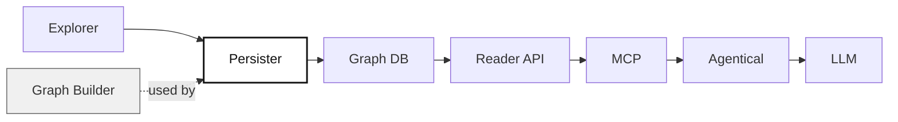

# Graph Persister

Graph Persister is a lightweight Python utility for persisting hierarchical Stochastic Block Model (hSBM) graphs using the `graph_builder` API. It serializes NetworkX graphs (with node and edge properties) to disk, producing a fast, indexable graph database. This database can be used for downstream analytics, visualization, and as a structured knowledge source for Large Language Models (LLMs) via the MCP (Modular Conversational Platform) ecosystem.

---

## 📊 Pipeline Overview

This utility is a key part of a modular pipeline for graph-based semantic applications:



**Legend:**
- The <span style="background-color:#fff;color:#111">highlighted</span> node is this utility.
- The pipeline shows how a graph is created, persisted, indexed, served, and ultimately made accessible to LLMs for semantic conversation via MCP and Agentical.

---

## ✨ Features
- Converts NetworkX hSBM graphs to a persistent, indexable format
- Stores node and edge properties, including hierarchical levels
- Uses SQLite for efficient indexing
- Modular, extensible, and easy to integrate
- Enables use of graph data as structured knowledge for LLMs and AI applications

---

## 🚀 Quickstart

### Requirements
- Python 3.12+
- [NetworkX](https://networkx.org/)
- [pytest](https://pytest.org/) for testing

### Setup
1. **Clone the repository:**
   ```bash
   git clone <your-repo-url>
   cd <your-repo>
   ```
2. **Create a virtual environment:**
   ```bash
   python3 -m venv .venv
   source .venv/bin/activate
   ```
3. **Install dependencies:**
   ```bash
   pip install -r requirements.txt
   ```

### Usage
1. **Prepare your NetworkX graph** (e.g., `topic_graph.gpickle`).
2. **Run the persister:**
   ```bash
   python -m graph_persister.persister
   ```
   This will load the graph and persist it to the `.graph/graphdb` directory.

---

## 🧩 How This Utility Fits In
- **Input:** Receives a pickled NetworkX graph from a graph explorer/creator.
- **Processing:** Persists the graph using the `graph_builder` API, creating a database with fast indices.
- **Output:** The resulting graph database is used by a FastAPI-based Graph Reader API, which is then wrapped by FastApiMCP to expose MCP endpoints.
- **Integration:** Agentical connects the MCP endpoints to LLMs, enabling semantic, graph-aware conversations.

---

## 📁 Project Structure
```
├── src/                # Main source code (if applicable)
├── graph_persister/    # Core logic for graph persistence
│   └── persister.py    # Main entry point for persisting graphs
├── tests/              # Unit and integration tests
├── requirements.txt    # Python dependencies
├── README.md           # Project documentation
├── .gitignore          # Git ignore rules
```

---

## 📝 License
MIT License

## 🙏 Acknowledgments
- [NetworkX](https://networkx.org/)
- [graph_builder](https://github.com/your-org/graph_builder) (if public)
- [FastAPI](https://fastapi.tiangolo.com/) (for downstream API)

---

For more details, see the code and docstrings in each module.